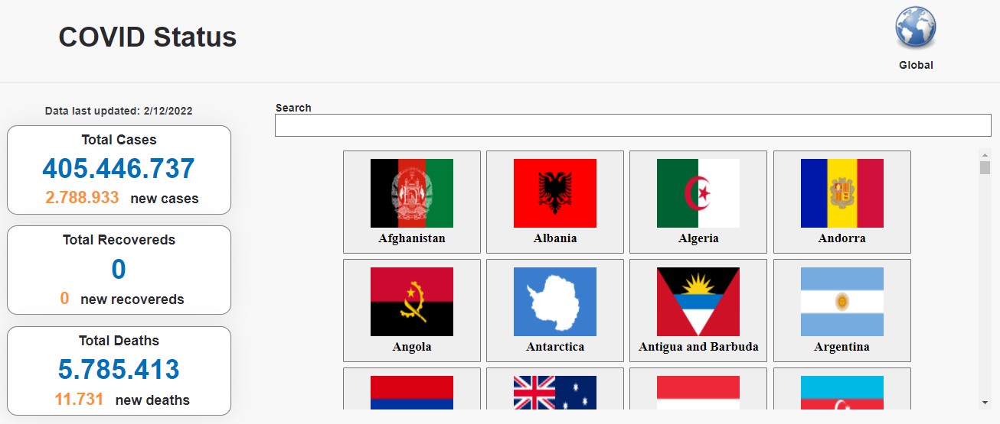
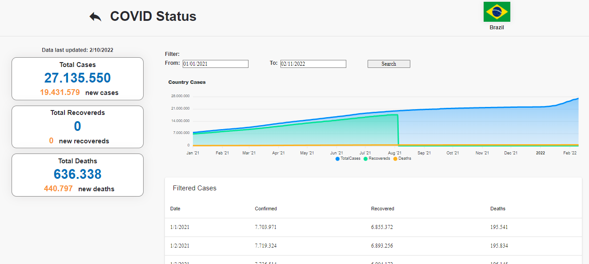
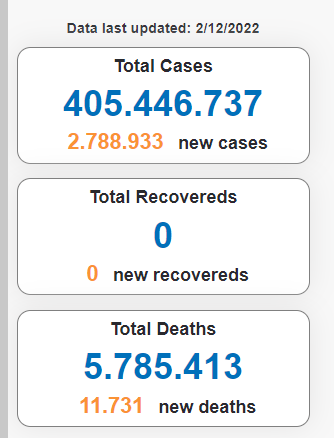
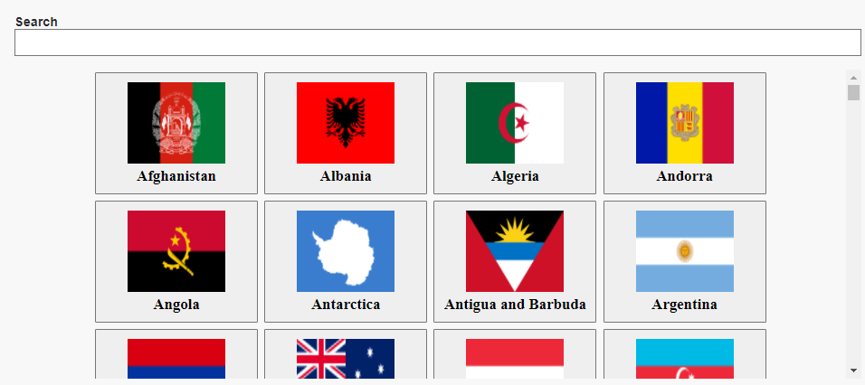
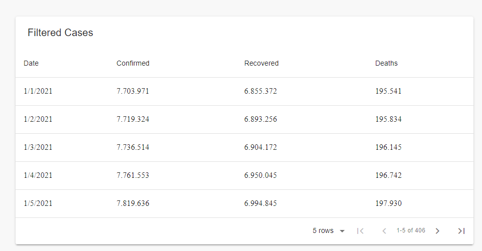

<div align="center">
  <h1 align="center">Project COVID Status</h1>
  <br />
  <p align="center">
    <a href="http://LucasMeloMB.github.io/covid19-react">VIEW DEMO</a>
  </p>
</div>



<br />



# Table of Contents

<!--ts-->

-   [About the Project](#about-the-project)
-   [Technologies](#technologies)
-   [Getting Started](#getting-started)
    -   [Prerequisites](#prerequisites)
    -   [Installation](#installation)
-   [Components](#components)
    -   [Cases Panel](#cases-panel)
    -   [Flag List](#flag-list)
    -   [Cases Chart](#cases-chart)
    -   [Cases Table](#cases-table)
-   [Libraries](#libs)
<!--te-->

### About the Project

This project was created using [React](https://reactjs.org/) and uses the [COVID19 Public API](https://covid19api.com/) to monitor Covid 19 cases worldwide or by country

Main features:

* World Total Cases

  _The App show total amount of confirmed, recovered and the total of deaths caused by COVID19._
  
* Cases By Country

  _The user is able to search for country specific data. This can be done either with a dropdown or with a standard text input. This shown the current count of confirmed, recovered and the total of deaths caused by COVID19 in that country._
  
* Cases By Country On a Specific Date

  _The user is able to select a specific date period for the desired country's data._
  
  * List Cases of a Country from a time period

    _If the user selects a time period bigger than a day, then the page list the data for COVID19 cases for each day from the selected time period._

### Technologies

The following tools were used in building the project:

-   [Node.js](https://nodejs.org/en/)
-   [React](https://reactjs.org/)
-   [TypeScript](https://www.typescriptlang.org/)

### Getting Started

### Prerequisites

Before starting, you will need to have the following tools installed on your machine:
[Git](https://git-scm.com), [Node.js](https://nodejs.org/en/).
Besides, it's good to have an editor to work with the code like [VSCode](https://code.visualstudio.com/)

### Installation

Clone this repo

```bash
git clone https://github.com/LucasMeloMB/covid19-react.git
```

Install the Packages

```bash
yarn install
```

Open the Project

```bash
cd covid19-react
```

Init the project

```bash
yarn start
```

Access app in the browser

```bash
http://localhost:3000/covid19-react
```

### Components

These are the main components of this app.

### Cases Panel

This component shows total covid cases, total recovered and total deaths by country or globally.


### Flag List

This component brings the list of all countries brought by the API along with their flags. By clicking on the country the user is redirected to the country information page.


### Cases Chart

This component displays a graph showing the progression of increase in Covid cases in each country.


### Cases Table

This component displays a table listing cases in the country using date filtering.


### Libraries

The two main libraries used in this project are [Apexcharts](https://apexcharts.com/) to build graphs and [Material Table](https://github.com/mbrn/material-table) to build tables.
